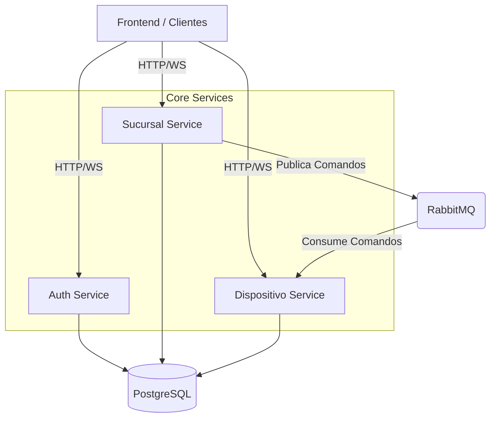

# Documentación General del Proyecto: Multiroom Backend

Este documento proporciona una visión técnica detallada del ecosistema de microservicios "Multiroom", diseñado para la gestión de salas, dispositivos, inventario y ventas.

## 1. Visión General del Sistema

Multiroom es una plataforma de gestión integral orientada a establecimientos que ofrecen servicios basados en tiempo y consumo (ej. salas de juegos, centros de entretenimiento). El sistema permite controlar dispositivos de forma remota, gestionar sucursales, administrar inventario y procesar ventas.

### Justificación de Arquitectura
El sistema adopta una arquitectura de **microservicios** para garantizar:
- **Desacoplamiento**: La lógica de ventas (Sucursal) es independiente del control de hardware (Dispositivo).
- **Escalabilidad**: El servicio de dispositivos puede escalar horizontalmente para manejar miles de conexiones WebSocket concurrentes sin afectar al ERP principal.
- **Resiliencia**: RabbitMQ actúa como buffer para comandos críticos, asegurando que ninguna instrucción de encendido/apagado se pierda si un servicio se reinicia.

### Diagrama de Arquitectura


---

## 2. Stack Tecnológico

- **Lenguaje**: [Go (Golang) v1.24.5](https://go.dev/)
- **Framework Web**: [Fiber v2](https://gofiber.io/) (Alto rendimiento).
- **Base de Datos**: [PostgreSQL](https://www.postgresql.org/) con `pgx` driver.
- **Mensajería**: [RabbitMQ](https://www.rabbitmq.com/) (AMQP 0.9.1) para comunicación asíncrona.
- **Tiempo Real**: [WebSockets](https://github.com/gofiber/contrib/tree/main/v3/websocket).
- **Infraestructura**: Docker & Docker Compose.
- **Seguridad**: JWT (HS256) + Middleware RBAC customizado.
- **Reportes**: `Maroto v2` para generación programática de PDFs.

---

## 3. Estructura del Proyecto (Clean Architecture)

El proyecto implementa **Arquitectura Hexagonal (Ports & Adapters)**, lo que facilita el testing y el cambio de implementaciones de infraestructura sin tocar el dominio.

```text
<servicio>/
├── cmd/
│   └── main.go           # Entrypoint: Inicializa dependencias y arranca el servidor.
├── internal/
│   ├── core/             # EL NÚCLEO: Lógica pura de negocio.
│   │   ├── domain/       # Entidades y reglas de negocio agnósticas (Structs).
│   │   ├── port/         # Interfaces que definen contratos (Repository interfaces, Service interfaces).
│   │   ├── service/      # Implementación de Casos de Uso (orchestration).
│   ├── adapter/          # ADAPTADORES: Interactúan con el mundo exterior.
│   │   ├── handler/      # HTTP/WS Handlers (Entrada).
│   ├── postgresql/       # Implementación de persistencia (Salida).
│   ├── server/           # Configuración de Fiber y rutas.
├── sql/                  # Scripts SQL y migraciones.
├── Dockerfile            # Receta de construcción de imagen.
└── go.mod                # Gestión de módulos Go.
```

---

## 4. Servicios Principales

| Servicio | Puerto Interno | Puerto Host | Descripción Corta |
| :--- | :--- | :--- | :--- |
| **Auth Service** | 8080 | 9101 | IAM Centralizado. Gestiona usuarios, roles y tokens JWT. |
| **Dispositivo Service** | 8081 (HTTP)<br>8082 (WS) | 9102<br>9103 | Gateway de IoT. Mantiene conexiones vivas con el hardware físico. |
| **Sucursal Service** | 8083 (HTTP)<br>8084 (WS) | 9104<br>9105 | ERP del negocio (Ventas, Inventario, Salas). |

---

## 5. Casos de Uso Críticos (Flujos)

### A. Inicio de Sesión de Juego
Este es el flujo más importante del negocio, donde convergen todos los servicios.

1. **Solicitud**: Empleado envía `POST /acciones/salas` al `Sucursal Service` con `{ sala_id: 5, tiempo: 60min }`.
2. **Registro**: `Sucursal Service` crea un registro en la tabla `uso_sala` con estado `En uso`.
3. **Evento**: `Sucursal Service` publica evento `sala.start` en RabbitMQ.
4. **Consumo**: `Dispositivo Service` escucha el evento.
5. **Acción Física**: `Dispositivo Service` busca el WebSocket del dispositivo asociado a la sala #5 y envía el comando `{ op: "UNLOCK" }`.
6. **Hardware**: La consola/PC se desbloquea físicamente.

### B. Compra de Inventario
1. **Orden**: Admin crea `Orden de Compra` en `Sucursal Service`.
2. **Recepción**: Al llegar la mercadería, se llama a `POST /compras/:id/completar`.
3. **Transacción**: El sistema actualiza el estado de la compra e incrementa el stock en la tabla `inventario` usando una transacción atómica SQL.

---

## 6. Configuración y Entorno

El sistema se configura mediante variables de entorno (Archivo `.env` o Docker enviroment).

### Variables Comunes
- `DB_URL`: Connection string de PostgreSQL.
- `RABBIT_URL`: Connection string de RabbitMQ (`amqp://...`).
- `JWT_SECRET`: Clave privada para firmar tokens.
- `HTTP_PORT`: Puerto de escucha del servicio.

### Configuración Docker (`docker-compose.yml`)
Define la orquestación local:
- **Red `multiroom-net`**: Permite resolución DNS interna entre contenedores (ej. `auth:8080` es accesible desde `sucursal`).
- **Volúmenes**: Persistencia de datos de BD y carga de SQL inicial.

---

## 7. Modelo de Datos Centralizado
El esquema reside en `sql/migrations.sql`.
- **RBAC**: `permiso` -> `rol_permiso` -> `rol` -> `usuario_admin`.
- **Negocio**: `sucursal` es la entidad raíz para inventarios y ventas.
- **Seguridad DB**: Triggers como `proteger_rol_admin` evitan corrupción de datos críticos.

> [!TIP]
> Para ver el detalle completo de tablas, consultar el archivo [sql/migrations.sql](sql/migrations.sql).

---

## 8. Desarrollo y Despliegue

### Ejecución Local
```bash
# Levantar todo el stack
docker-compose up -d --build

# Ver logs
docker-compose logs -f
```

### Endpoints de Salud (Health Checks)
Cada servicio expone `GET /api/v1/` que retorna `Server running`. Útil para liveness probes en Kubernetes o monitoreos.
